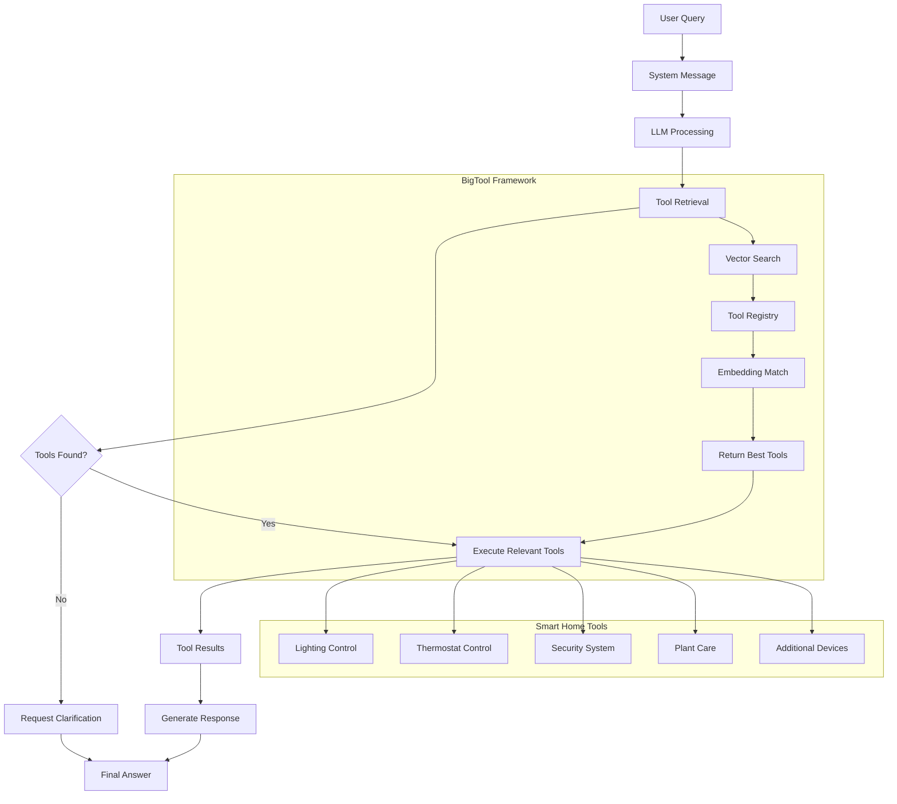

# Smart Home Automation Agent

A LangGraph-powered intelligent home automation system that uses OpenAI's language models and the BigTool framework to control various smart home devices through natural language interactions.

## 🏠 What This Project Does

This project demonstrates an AI agent that can understand natural language commands and execute them on a comprehensive smart home system. The agent can control:

- **Smart Lights**: Turn on/off, dim, change colors, control individual rooms or all lights
- **Thermostat**: Set temperature, change modes (heating/cooling/auto), schedule temperature changes
- **Security System**: Lock/unlock doors, check door status, manage security cameras, motion detection
- **Plant Care**: Water plants, check soil moisture, set watering schedules
- **Additional Smart Devices**: Window blinds, smart vacuum, music system, alarms, air quality monitoring, smart fans

## 🔧 What is BigTool and Why Use It?

**LangGraph BigTool** is a framework that enables AI agents to work with large numbers of tools efficiently. Instead of loading all tools into the agent's context at once (which would exceed token limits), BigTool:

1. **Creates a searchable tool registry** using vector embeddings
2. **Dynamically retrieves relevant tools** based on the user's query
3. **Scales to hundreds or thousands of tools** without context overflow
4. **Improves response accuracy** by providing only the most relevant tools for each task

In our smart home system, we have 25+ different tools. BigTool allows the agent to:

- Find the right tool for "turn off kitchen lights" (retrieves `turn_off_light`)
- Handle complex queries like "I'm cold" (retrieves thermostat and heating tools)
- Scale to even more devices without performance degradation

## 🚀 Setup Instructions

### Prerequisites

1. **Install uv** (Python package manager):

   ```bash
   curl -LsSf https://astral.sh/uv/install.sh | sh
   ```

2. **Set up environment variables**:
   Create a `.env` file in the project root:

   ```bash
   # Required for OpenAI integration
   OPENAI_API_KEY=your_openai_api_key_here
   ```

### Installation

1. **Clone the repository**:

   ```bash
   git clone <repository-url>
   cd agent-big-tool
   ```

2. **Install dependencies using uv**:
   ```bash
   uv sync
   ```

## 🏃‍♂️ Running the Project

Execute the smart home automation demo:

```bash
uv run python graph.py
```

This will run through several example queries:

- "Turn off the lights in the kitchen"
- "Set the thermostat to 70 degrees"
- "Lock the front door"
- "What's happening in the living room?"
- "It's a little dirty, can you vacuum the living room?"
- "I'm cold, can you turn on the heat?"

## 🏗️ Agent Architecture

The system uses LangGraph to create a sophisticated agent workflow:



## 🛠️ Key Components

### 1. Agent Configuration (`graph.py`)

- **LLM**: Uses OpenAI's GPT-4o for natural language understanding
- **Tool Registry**: Maps unique IDs to tool instances
- **Vector Store**: InMemoryStore with OpenAI embeddings for tool retrieval
- **Graph Compilation**: Creates the executable agent workflow

### 2. Tool Collection (`tools.py`)

- **25+ Smart Home Tools**: Comprehensive coverage of home automation
- **Langchain Tool Format**: Properly decorated with descriptions for LLM understanding
- **Realistic Responses**: Simulated but realistic tool responses

### 3. BigTool Integration

- **Semantic Tool Search**: Finds relevant tools based on query similarity
- **Efficient Tool Loading**: Only loads tools needed for specific queries
- **Scalable Architecture**: Can handle hundreds of tools without performance issues

## 📦 Dependencies

- **langchain**: Core framework for LLM applications
- **langchain-openai**: OpenAI integration for chat and embeddings
- **langgraph**: Workflow orchestration framework
- **langgraph-bigtool**: BigTool framework for large-scale tool management
- **python-dotenv**: Environment variable management

## 🎯 Example Interactions

The agent can handle various types of natural language commands:

- **Direct Commands**: "Turn off the kitchen lights"
- **Contextual Requests**: "I'm cold" → Adjusts thermostat/heating
- **Complex Queries**: "Secure the house for the night" → Locks doors, checks cameras
- **Maintenance Tasks**: "The living room needs cleaning" → Starts vacuum

## 🔮 Extending the System

To add new smart home devices:

1. **Create new tools** in `tools.py` following the `@tool` decorator pattern
2. **Add tools to `HOME_AUTOMATION_TOOLS`** list
3. **The BigTool framework** will automatically make them searchable
4. **Test with natural language** queries that would use the new tools

## 📄 License

This project is licensed under MIT License - see the LICENSE file for details.
